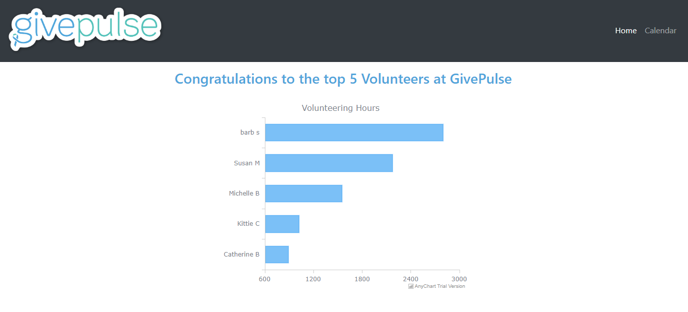
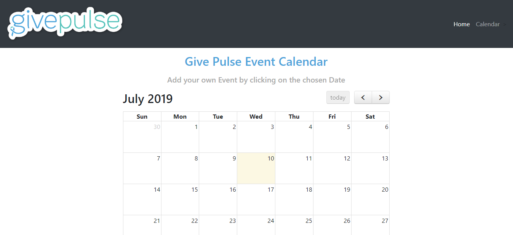

# PHP Anychart for GivePulse - Home Page

On the Home Page This example shows the 5 top volunteers for GivePulse by Hours using the bar Anychart library, with the PHP programming language and MySQL database provided by Givepulse.

The chart data is taking from two tables, the Users and the Impacts, those two are LEFT JOIN
so we can connect the user_id on the Impacts table with the names on the Users table. Once that's done, the query ORDER BY duration_hours and just limits the information to 5 rows.

The page is responsive to any device using a Navigation and Container elements from Bootstrap.



# Full Calendar - Calendar Page

FullCalendar.io JavaScript was added to manage events with a PHP calendar. An event can be added and deleted by clicking on the chosen date.
The event CRUD operations are requested via AJAX using this library callbacks.
The page is responsive to any device using a Navigation and Container elements from Bootstrap.



## Running

To use this application you must have PHP installed, if not, please, install it as described [here](http://php.net/manual/en/faq.installation.php);
MySQL installed and running, if not, please, check out [MySQL download page](https://dev.mysql.com/downloads/installer/) and follow [these instructions](http://dev.mysql.com/doc/refman/5.7/en/installing.html).

To check your installations, run the following command in the command line:
```
$ php -v
PHP 5.6.27-1+deb.sury.org~trusty+1 (cli)  # sample output
Copyright (c) 1997-2016 The PHP Group
Zend Engine v2.6.0, Copyright (c) 1998-2016 Zend Technologies
    with Zend OPcache v7.0.6-dev, Copyright (c) 1999-2016, by Zend Technologies

$ mysql --version
mysql  Ver 14.14 Distrib 5.5.54, for debian-linux-gnu (x86_64) using readline 6.3 # sample output
```

To start this example run commands listed below.

Clone the repository from github.com:
```
$ git clone https://github.com/rebecalvarez/anychart.git
```

Navigate to the repository folder:
```
$ cd anychart
```

Ensure you have php-mysql being installed, run:
```
$ php -m
```
If there isn't `mysql` in the list install it:
```
$ sudo apt-get install php{your_php_version}-mysql # e.g. sudo apt-get install php5.6-mysql
```

Set up MySQL database, use `-u -p` flags to provide username and password:
```
$  mysql < givepulse_test.sql
```

Drop `index.php`, `data.php`, `calendar.php`,`js` and `css`folder and folders to a folder where you serve your .php files and your server (e.g. Apache or Nginx) could get them.
Open browser at an appropriate url.

Now you can update MySQL database data, run (don't forget to use `-u -p` flags if you need):
```
$  mysql < givepulse_test.sql
```
The chart on web page will update automatically.

To finally run the application:
```
$  php -S localhost:8080php
```


## Technologies
Language - [PHP](http://php.net)<br />
Language - [JavaScript](https://www.javascript.com/)<br />
Database - [MySQL](https://www.mysql.com/)<br />
Style - [Bootstrap](https://getbootstrap.com/)


## Licenses


[](https://www.anychart.com)


AnyChart PHP/MySQL integration sample includes two parts:
- Code of the integration sample that allows to use Javascript library (in this case, AnyChart) with PHP language and MySQL database. You can use, edit, modify it, use it with other Javascript libraries without any restrictions. It is released under [Apache 2.0 License](https://github.com/anychart-integrations/plain-php-mysql-template/blob/master/LICENSE).
- AnyChart JavaScript library. It is released under Commercial license. You can test this plugin with the trial version of AnyChart. Our trial version is not limited by time and doesn't contain any feature limitations. Check details [here](https://www.anychart.com/buy/).

If you have any questions regarding licensing - please contact us. <sales@anychart.com>

[](https://github.com/igrigorik/ga-beacon)


fullcalendar/fullcalendar is licensed under the

MIT License
A short and simple permissive license with conditions only requiring preservation of copyright and license notices. Licensed works, modifications, and larger works may be distributed under different terms and without source code.

#### Permissions
:heavy_check_mark: Commercial use
:heavy_check_mark: Modification
:heavy_check_mark: Distribution
:heavy_check_mark: Private use

#### Limitations
:x: Liability
:x: Warranty

#### Conditions
 License and copyright notice

